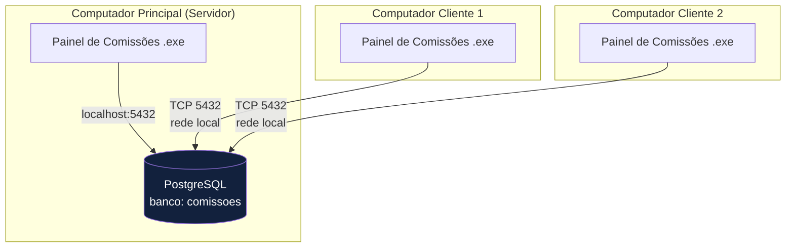
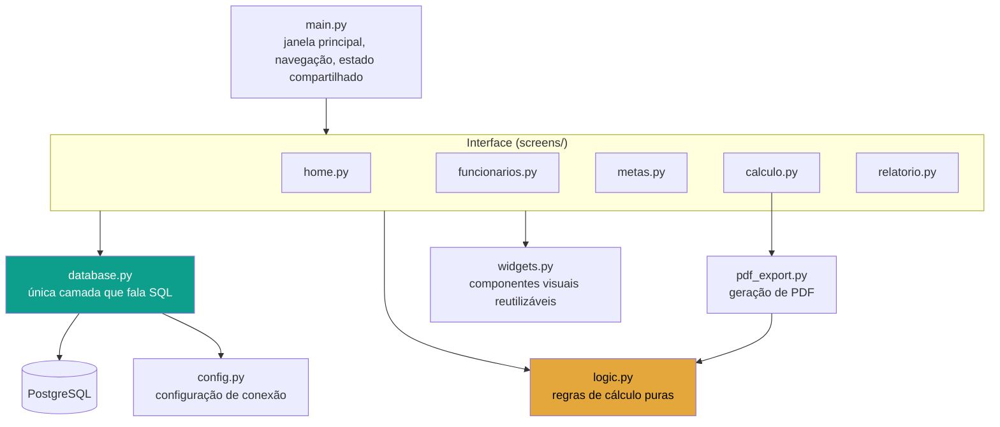
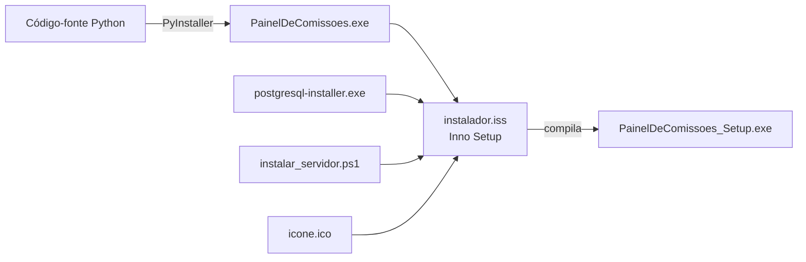

# Arquitetura — Painel de Comissões

## Topologia de implantação (rede local)

Um computador da rede local hospeda o banco de dados; os demais se
conectam nele pela rede. Não existe servidor de aplicação — cada
computador roda uma cópia completa do programa, e todos compartilham
o mesmo PostgreSQL.

Cada computador guarda localmente um `config.json` com o endereço do
servidor (`host`, `port`, `dbname`, `user`, `password`) — ver
`config.py`. No servidor, `host` é `localhost`; nos clientes, é o IP
do servidor na rede.

## Camadas da aplicação

**Princípio central do projeto:** nenhuma tela executa SQL
diretamente — tudo passa por `database.py`. Foi essa separação que
permitiu trocar a persistência de SQLite para PostgreSQL no meio do
desenvolvimento sem alterar nenhuma tela. Da mesma forma, `logic.py`
não conhece a interface gráfica — só recebe dados e devolve números,
o que permite testar as regras de cálculo isoladamente (via script,
sem abrir a janela).

## Fluxo de empacotamento

Ver `README.md` para o passo a passo completo de geração do
instalador.
