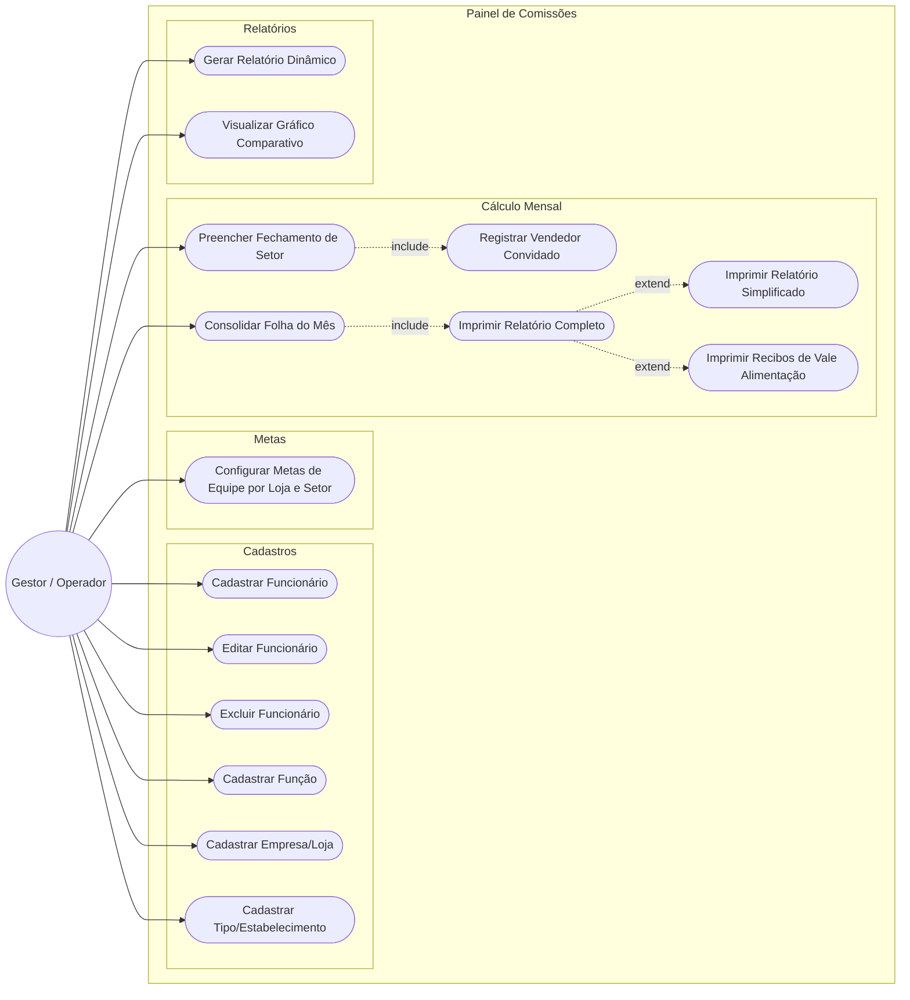

# Casos de Uso — Painel de Comissões

O sistema tem um único ator principal: o **Gestor/Operador** — a pessoa
que usa o programa no dia a dia (dono da loja, RH, ou responsável pelo
fechamento de comissões). Não há login/perfis diferentes; qualquer
computador com acesso ao banco de dados compartilhado tem as mesmas
permissões.

## Diagrama

## Descrição dos casos de uso

### Cadastros

| Caso de uso                    | Descrição                                                                                                                                                       | Pré-condição                                               |
| ------------------------------ | --------------------------------------------------------------------------------------------------------------------------------------------------------------- | ---------------------------------------------------------- |
| Cadastrar Funcionário          | Registra um novo funcionário: ID, nome, função, empresa, estabelecimento, salário, vale, comissão, metas individuais, flags de bônus de equipe e envio contábil | Ao menos uma Função, Empresa e Estabelecimento cadastrados |
| Editar Funcionário             | Altera os dados de um funcionário já cadastrado                                                                                                                 | Funcionário existente                                      |
| Excluir Funcionário            | Remove um funcionário e todas as metas individuais associadas                                                                                                   | Funcionário existente                                      |
| Cadastrar Função               | Cria um novo cargo, definindo se ele possui metas individuais e comissão                                                                                        | —                                                          |
| Cadastrar Empresa/Loja         | Cria uma nova filial no sistema                                                                                                                                 | —                                                          |
| Cadastrar Tipo/Estabelecimento | Cria um novo setor (ex: Oficina, Autopeças)                                                                                                                     | —                                                          |

### Metas

| Caso de uso                                 | Descrição                                                                                              | Pré-condição                          |
| ------------------------------------------- | ------------------------------------------------------------------------------------------------------ | ------------------------------------- |
| Configurar Metas de Equipe por Loja e Setor | Define os níveis de meta coletiva (valor + bonificação) para uma combinação específica de loja e setor | Empresa e Estabelecimento cadastrados |

### Cálculo Mensal

| Caso de uso                                     | Descrição                                                                                                                                                                                  | Pré-condição                                      |
| ----------------------------------------------- | ------------------------------------------------------------------------------------------------------------------------------------------------------------------------------------------ | ------------------------------------------------- |
| Preencher Fechamento de Setor                   | Lança o valor vendido/devolvido por cada vendedor de um setor, em um mês específico                                                                                                        | Funcionários com metas cadastrados no setor       |
| Registrar Vendedor Convidado _(include)_        | Adiciona ao fechamento de um setor um funcionário de outro setor que vendeu ali; a venda conta no total do setor, mas o bônus de equipe continua sendo do setor de origem dele             | Fechamento de setor em edição                     |
| Consolidar Folha do Mês                         | Junta todos os fechamentos de setor de um mês e calcula o total a receber de cada funcionário (comissão e metas individuais consideram tudo que a pessoa vendeu no mês, em qualquer setor) | Ao menos um fechamento de setor salvo naquele mês |
| Imprimir Relatório Completo _(include)_         | Gera um PDF com o resumo por loja/setor e a tabela de todos os funcionários da folha do mês                                                                                                | Folha do mês consolidada                          |
| Imprimir Relatório Simplificado _(extend)_      | Gera um PDF compacto (nome, comissão, bonificações) agrupado por loja/setor, só com quem está marcado para "Enviar Contábil"                                                               | Folha do mês consolidada                          |
| Imprimir Recibos de Vale Alimentação _(extend)_ | Gera um PDF com um recibo por funcionário com vale preenchido, vários por folha                                                                                                            | Folha do mês consolidada                          |

### Relatórios

| Caso de uso                    | Descrição                                                                                                                   | Pré-condição                 |
| ------------------------------ | --------------------------------------------------------------------------------------------------------------------------- | ---------------------------- |
| Gerar Relatório Dinâmico       | Monta uma tabela comparativa (linhas × colunas × métrica) a partir dos meses fechados — por mês, loja, setor ou funcionário | Ao menos um fechamento salvo |
| Visualizar Gráfico Comparativo | Exibe em gráfico (linhas, barras ou barras agrupadas) o relatório dinâmico gerado                                           | Relatório dinâmico gerado    |
