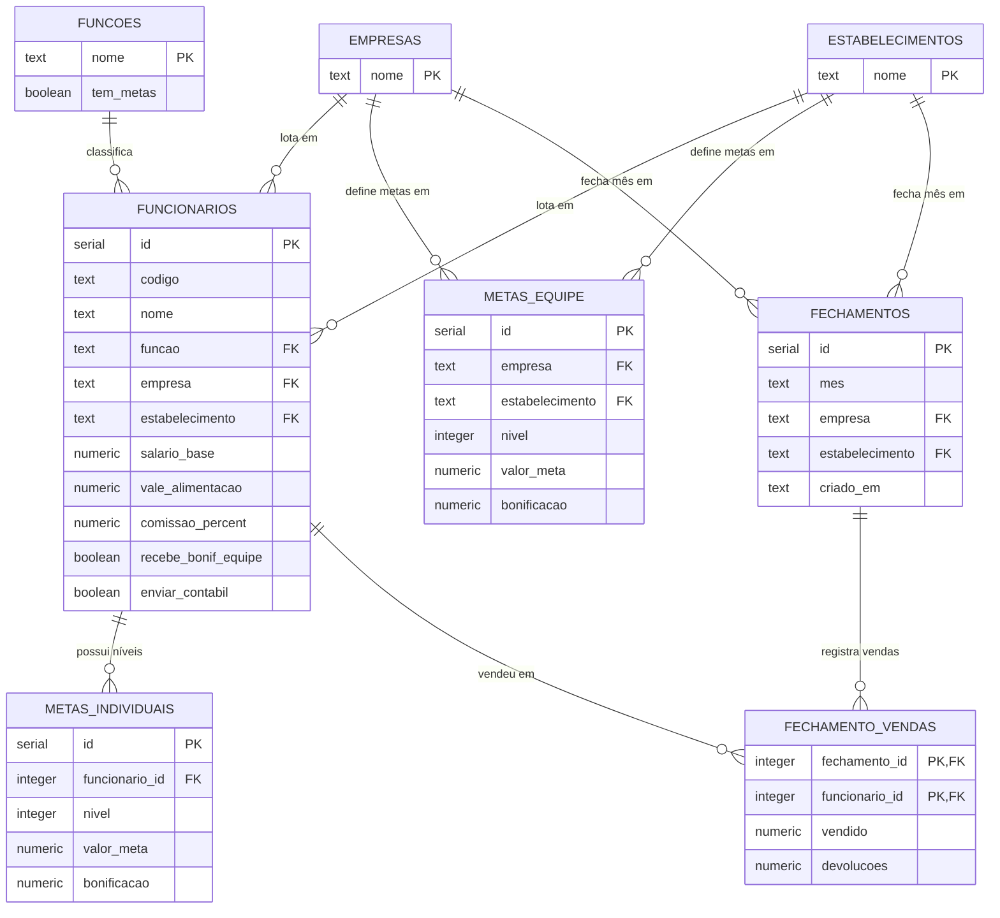

# Diagrama de Entidade-Relacionamento (DER) — Painel de Comissões

Baseado no schema real do PostgreSQL (ver `database.py`). As tabelas
`funcoes`, `empresas` e `estabelecimentos` funcionam como **listas de
valores válidos**: não têm chave estrangeira física ligando a
`funcionarios` (o campo é só `TEXT`), mas a aplicação sempre valida
contra elas antes de gravar — por isso aparecem ligadas no diagrama
como relação lógica.

## Diagrama

## Descrição das entidades

| Tabela              | Chave primária                    | O que representa                                                                                                                                                                                      |
| ------------------- | --------------------------------- | ----------------------------------------------------------------------------------------------------------------------------------------------------------------------------------------------------- |
| `funcoes`           | `nome`                            | Cargos/funções cadastráveis (ex: Vendedor, Caixa). `tem_metas` decide se quem tem essa função ganha comissão e pode ter metas individuais.                                                            |
| `empresas`          | `nome`                            | Lojas/filiais cadastradas.                                                                                                                                                                            |
| `estabelecimentos`  | `nome`                            | Tipos de setor (ex: Oficina, Autopeças).                                                                                                                                                              |
| `funcionarios`      | `id`                              | Cadastro de cada funcionário, incluindo a que empresa/setor ele pertence "de origem" — é esse vínculo que define de onde vem o bônus de equipe dele.                                                  |
| `metas_individuais` | `id`                              | Níveis de meta individual de um funcionário específico (1‑N por funcionário).                                                                                                                         |
| `metas_equipe`      | `id`                              | Níveis de meta coletiva configurados por combinação de loja + setor (`UNIQUE(empresa, estabelecimento, nivel)`).                                                                                      |
| `fechamentos`       | `id`                              | Um fechamento mensal de UM setor específico (`UNIQUE(mes, empresa, estabelecimento)`) — é a unidade de preenchimento em Cálculo Mensal.                                                               |
| `fechamento_vendas` | `(fechamento_id, funcionario_id)` | Quanto cada funcionário vendeu/devolveu dentro de um fechamento de setor específico. Um funcionário pode aparecer em fechamentos de setores diferentes no mesmo mês (o caso do "vendedor convidado"). |

## Regras importantes que não aparecem no diagrama

- **Um funcionário pode ter vendas em `fechamento_vendas` de setores
  diferentes do seu setor de origem** (funcionalidade de "convidado") —
  isso é o que permite alguém da Oficina vender na Autopeças sem
  perder o vínculo de bônus com a Oficina.
- A **folha consolidada do mês** (usada nos relatórios e impressões)
  não é uma tabela — é calculada em tempo real por `logic.py`,
  juntando todos os `fechamentos` + `fechamento_vendas` de um mês com
  os dados de `funcionarios` e `metas_equipe`.
